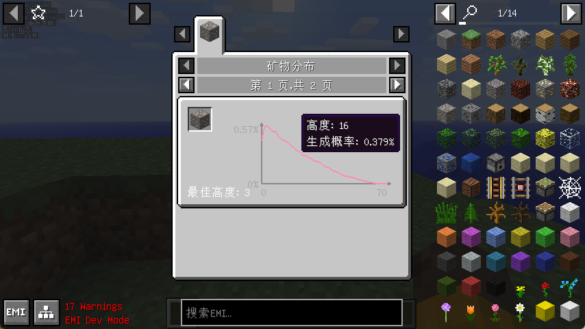
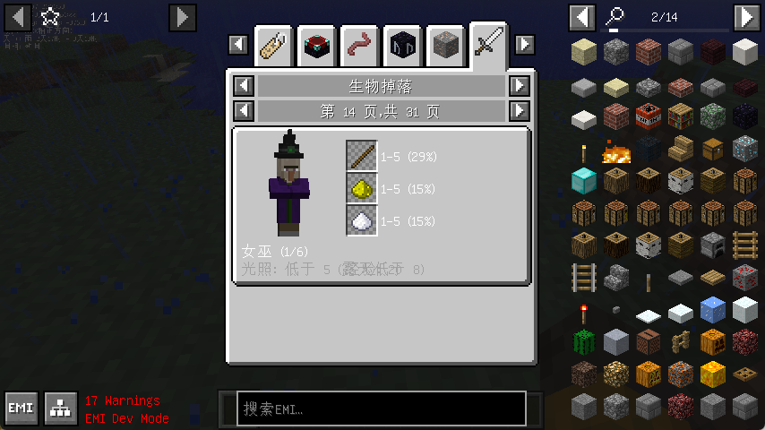
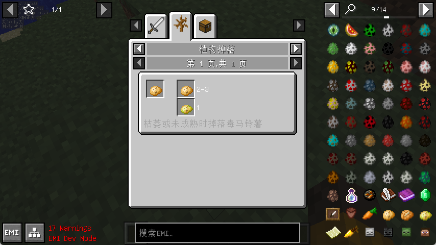
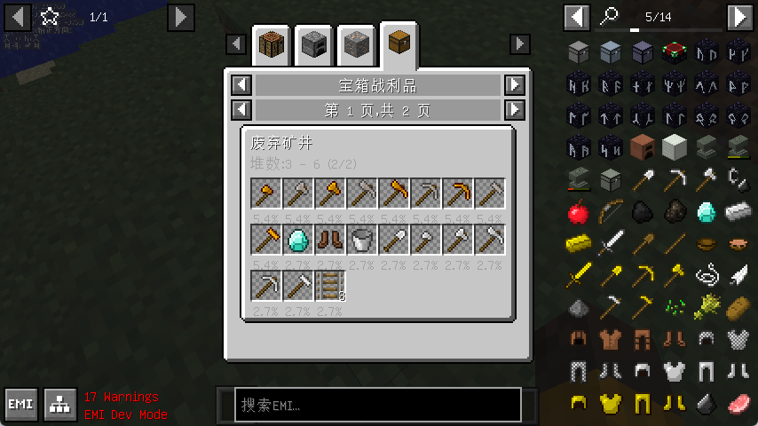
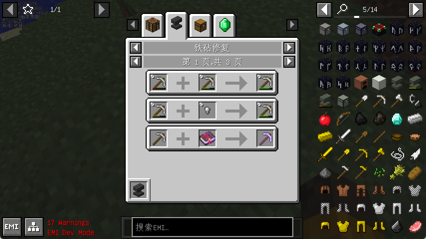
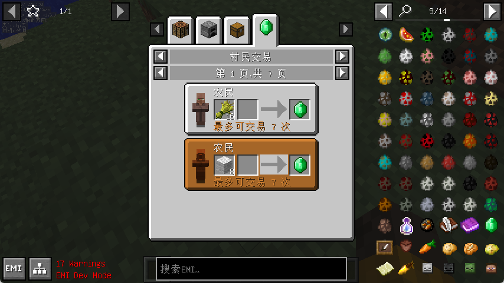

# NotEnoughResources-MITE

An EMI addon for MITE 1.6.4 on FishModLoader. It adds six categories to EMI's sidebar:

| Category | What it shows |
| --- | --- |
| Ore Distribution | The height curve for every ore, per dimension, with the best Y to dig at <details><summary>[showcase]</summary></details> |
| Mob Drops | Each mob's model, spawn light level, experience, and drop table <details><summary>[showcase]</summary></details> |
| Plant Drops | What crops and grass yield when harvested <details><summary>[showcase]</summary></details> |
| Chest Loot | Every generated chest, its stack count, and per-item odds <details><summary>[showcase]</summary></details> |
| Enchantments | Which enchantments each item accepts, with level ranges <details><summary>[showcase]</summary></details> |
| Villager Trades | Every trade each profession can offer, with its price range <details><summary>[showcase]</summary></details> |

This is a rewrite of [NotEnoughResources](https://github.com/Way2Muchnoise/NotEnoughResources)
(1.7.10 Forge + NEI) against MITE's own generation code, not a port of the original jar.

## Requirements

- MITE 1.6.4
- FishModLoader 3.4.0+
- RustedIronCore 1.3.5+
- EMI 1.1.27+

## Where the numbers come from

Everything is derived from MITE's own code rather than copied from a wiki, so the figures track the
version you are running:

- **Ore distributions** replay `WorldGenMinable.generate` and `growVein` directly. The vein size in
  MITE passes through a geometric product of random factors, a clamp, a depth-dependent rescale, and
  special cases for one- and two-block veins, none of which has a tidy closed form — so rather than
  approximating it, the mod samples the real algorithm and reports what it produces. Vein sizes are
  read from a live `BiomeDecorator`, so retuning them in MITE is picked up automatically.
- **Chest loot** is read from each structure's static loot table, with the roll counts taken from
  where the structure generates its chest.
- **Mob and plant drops** are transcribed by hand from `dropFewItems` and `dropBlockAsEntityItem`,
  because those need a live world and drop items into it rather than returning them. Every table in
  `MITEMobData` and `MITEPlantData` cites the method it came from.
- **Villager trades** are half read, half transcribed. Which items a profession deals in is inlined in
  the private `addDefaultEquipmentAndRecipies`, which hands out one random trade per call and cannot
  be asked for the full set, so that list is written out in `MITETradeData`. The amounts are not:
  they come from MITE's own `villagerStockList` and `blacksmithSellingList`, read through the access
  widener, so retuned prices need no change here.

### Reading the ore percentages

The percentage at a given Y is the chance that a randomly chosen block at that height is this ore.
Two approximations remain, and both only matter within a few blocks of bedrock or the world ceiling:

- The world is treated as solid stone. In practice a vein attempt is abandoned if it starts in air,
  water, or an existing vein, so real densities are marginally lower.
- Blocks a vein would place outside 0–255 are dropped, whereas MITE would retry another direction.

Quantities on the mob pages assume no Looting or Butchering; drops that respond to those
enchantments say so in their tooltip. Percentages are for a kill by the player, since MITE reduces
most drops otherwise.

### Reading the trade pages

MITE runs the 1.6.4 trading model, not the levelled one from 1.14. A villager starts with a single
trade and unlocks the next only after the last one is used, drawn from a shuffled pool, so a page
lists what a profession *can* offer rather than what any one villager will have. There are no trade
levels, no wandering trader, and no experience — every trade allows the seven uses `MerchantRecipe`
fixes in its constructor, which is why each page states the same limit.

Prices are usually a range, drawn in the slot as `4-5`, because MITE rolls the amount per trade.
Three things are deliberately not spelled out:

- **How likely a trade is.** Each candidate is rolled against a probability that shrinks as the
  villager's list grows, so there is no fixed number to put on a page.
- **What the priest's enchantment will be.** The enchanting service rolls one per trade, so the
  result is drawn unenchanted with a note rather than expanded into every outcome.
- **Prices above a stack.** Enchanted books are the one trade MITE never clamps, so a high level can
  ask for more emeralds than fit in a stack. The real range is shown rather than a capped one.

## Configuration

`config/emiresources.json`, written with defaults on first run:

| Key | Default | Meaning |
| --- | --- | --- |
| `itemsPerColumn` | 4 | Items per column on the mob and chest pages |
| `cycleTimeSeconds` | 2.0 | How long each item is shown before cycling |
| `extraYRange` | 4 | Extra Y levels drawn either side of an ore's range |

## Development

```sh
JAVA_HOME=/path/to/jdk-17 ./gradlew build
```

Run Gradle itself on JDK 17. On a newer JDK it fails while compiling the build script, because
Gradle 8.5 cannot read class files above major version 65. The forked JVMs — `runClient`,
`runServer` and `probe` — are pinned to 17 by the build, since Mixin 0.8.5 bundles an ASM that
cannot read newer class files and aborts partway through applying mixins.

### Running the client on Apple Silicon

`runClient` needs an x86_64 JVM. Minecraft 1.6.4 uses LWJGL 2.9.1, whose macOS natives predate
Apple Silicon and contain only i386 and x86_64 slices, so an arm64 JVM cannot load
`liblwjgl.dylib`. Install an x86_64 JDK 17 and point the build at it — Rosetta 2 handles the rest:

```sh
JAVA_HOME=/path/to/x64/jdk-17 ./gradlew runClient
```

`./gradlew build` and `./gradlew probe` are unaffected and run natively on arm64.

### `./gradlew probe`

A headless diagnostic that exercises the MITE data this mod reads — the nine static loot tables, the
null-world entity constructors, and all five data paths end to end — and prints what each produced.
It needs no client and no GUI, so it is the quickest way to tell whether a MITE update moved
something. Run it after changing anything under `emiresources.mite`.

## Credits

The original NotEnoughResources was written by Way2Muchnoise and Mannor. The distribution graph and
entity rendering here follow their approach.
